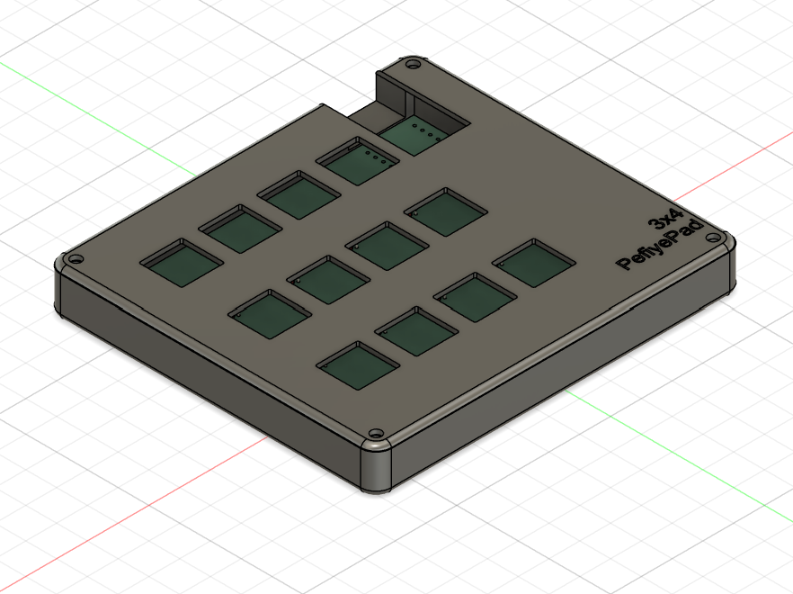
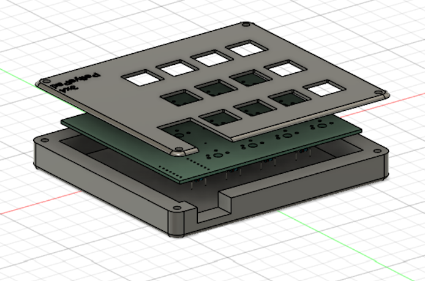
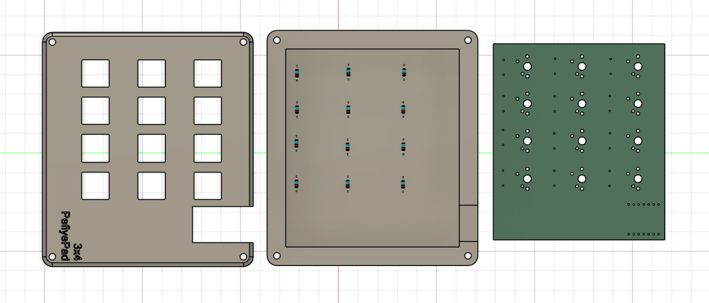
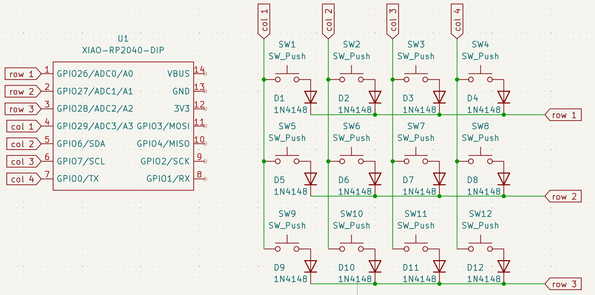
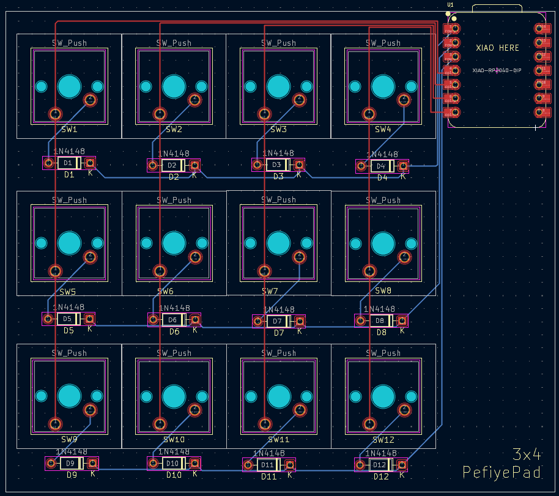

# PefiyePad
3x4 MacroPad 
im currently using a wireless numpad with auto hotkey for my shortcuts like muting and deafen on discord, but i was scrolling on Instagram reels and saw the ad for blueprints and i thought oh this is interesting, so i followed the guide from the blueprint website and i made this! a 3x4 macropad!

## Features
 
MX Switches  
1N4148 Diodes  
Seeed XIAO Raspberry Pico Micro Controller  

## CAD Model
 
Fit Using M3x16mm screws  
 

 
Made In Fusion 360  

## PCB
 
Schematic  
 

  
 
PCB  
 

## Firmware
 
Using Python KMK  

## BOM
 

Seeed XIAO RP2040 
12x Through-hole 1N4148 Diodes  
12x MX-Style switches 
